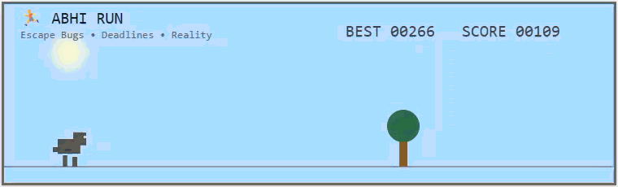

<p align="center">
  
</p>

<h1 align="center">🏃 ABHI RUN</h1>

<p align="center">
An endless runner game inspired by the Chrome Dino Game, reimagined with a programmer's life.
</p>

<p align="center">

<a href="https://abhijitpavse.github.io/ABHI-RUN/">

</a>

</p>

<p align="center">


</p>

---

# 🎮 Play Now

### 👉 https://abhijitpavse.github.io/ABHI-RUN/

---

# 📖 About

**ABHI RUN** is a fun endless runner game built using **HTML5 Canvas, CSS and JavaScript**.

Inspired by the classic Chrome Dino Game, this version follows **Abhi**, a programmer who must survive the daily coding journey by avoiding obstacles and chasing the highest score.

---

# ✨ Features

- 🏃 Endless Runner Gameplay
- 🌞 Dynamic Day & Night Cycle
- ☁️ Animated Clouds
- ⭐ Beautiful Night Sky
- 📈 High Score Counter
- ⚡ Increasing Difficulty
- 📱 Mobile Friendly
- 💻 Desktop Support
- 🎯 Smooth Keyboard Controls
- 👆 Touch Controls
- 🎨 Pixel Art Style

---

# 🎮 Controls

| Action | Key |
|---------|-----|
| Jump | Space |
| Jump | ↑ Arrow |
| Jump | Mobile Tap |

---

# 🛠 Built With

- HTML5
- CSS3
- JavaScript
- HTML5 Canvas API

---

# 📂 Project Structure

```text
ABHI-RUN/

├── index.html
├── README.md
```

---

# 🚀 Future Improvements

- 👤 Pixel-Art Abhi Character
- 🐞 Bug Obstacles
- ☕ Coffee Power-ups
- 📅 Deadline Obstacles
- 💻 Laptop Collectibles
- 🔊 Sound Effects
- 🎵 Background Music
- 💾 Save High Score
- 🏆 Achievement System
- 🌍 Global Leaderboard

---

# 💡 Inspiration

This project is inspired by the famous **Google Chrome Dino Game** and redesigned with a programmer theme for fun and learning.

---

# 🤝 Contributing

Contributions are welcome!

1. Fork the repository
2. Create a feature branch
3. Commit your changes
4. Open a Pull Request

---

# ⭐ Support

If you enjoyed this project,

⭐ Star this repository

and share it with your friends!

---

## 👨‍💻 Author

**Abhijit Pavse**

GitHub: https://github.com/abhijitpavse

LinkedIn: https://linkedin.com/in/abhijitpavse

---

<p align="center">

If you're reading this... Abhi survived another deadline. 😎 Created using skills & 🧠.

</p>
